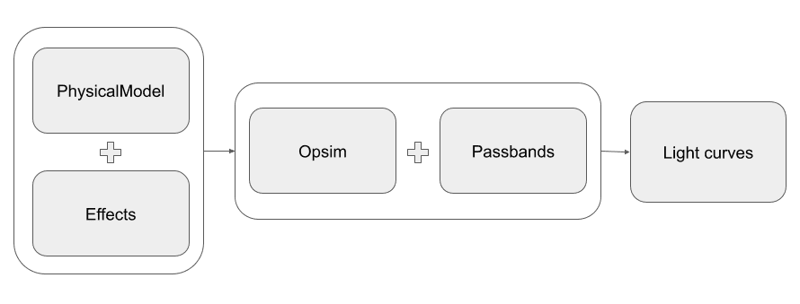

.. tdastro documentation main file.
   You can adapt this file completely to your liking, but it should at least
   contain the root `toctree` directive.

TDAstro
========================================================================================

Time-Domain Forward-Modeling for the Rubin Era
-------------------------------------------------------------------------------

Realistic light curve simulations are essential to many time-domain problems. 
Simulations are needed to evaluate observing strategy, characterize biases, 
and test pipelines. TDAstro aims to provide a flexible, scalable, and user-friendly
time-domain simulation software with realistic effects and survey strategies.

The main simulation components in TDAstro include:

* A statistical simulation step where the hyperparameters of the model are drawn
  from one or more prior distributions.
* ``PhysicalModel`` defines the properties of the time-domain source, which can 
  also include a host-galaxy model, and is used to generate the noise-free light curves.
* ``Opsim`` contains the survey information such as survey strategy and observing
  conditions. It is used to specify the observing times and bands.
* A set of predefined effects, such as dust extinction and detector noise, are applied to
  the noise-free light curves to produce realistic light curves.
* The ``PassbandGroup`` contains the filter information of the telescope and is used
  to calculate the fluxes in each band.

TDAstro can generate numerous random realizations of the parameters for the ``PhysicalModel``
to produce realistic light curves using the above components.  See the 
:doc:`simulations <simulations>` page for a more detailed description of the process.

For an overview of the package, we recommend starting with the notebooks in the "Getting Started"
section of the :doc:`notebooks page <notebooks>`.

The :doc:`glossary <glossary>` provides definitions of key terms, such as
*GraphState*, *Node*, *Parameter*, *ParameterizedNode*, *PhysicalModel*, and *Source*.

Getting Started
-------------------------------------------------------------------------------

.. code-block:: bash

   >> pip install tdastro

See our selection of :doc:`tutorial notebooks <notebooks>` for usage examples.
We recommend starting with the :doc:`introduction notebook <notebooks/introduction>`
to get a high level overview.

If you are interested in installing from source, or contributing to the package,
see the :doc:`contribution guide <contributing>`.

.. toctree::
   :hidden:

   Home page <self>
   Simulations <simulations>
   Notebooks <notebooks>
   API Reference <autoapi/index>
   Glossary <glossary>
   Contribution Guide <contributing>

Acknowledgements
-------------------------------------------------------------------------------

This project is supported by Schmidt Sciences.