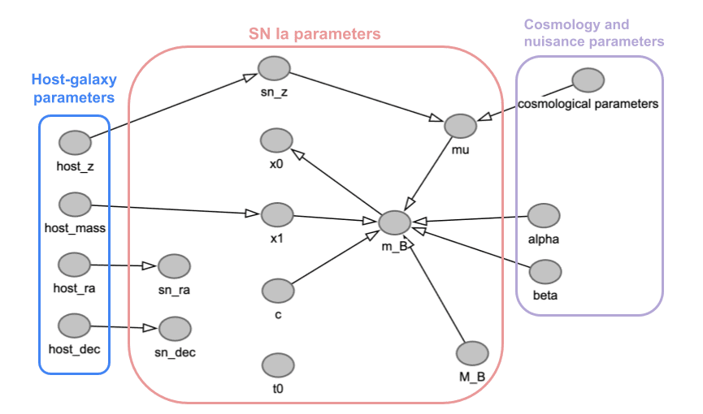
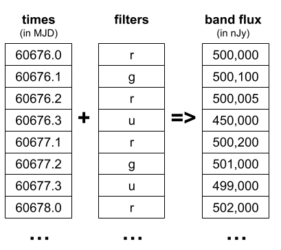
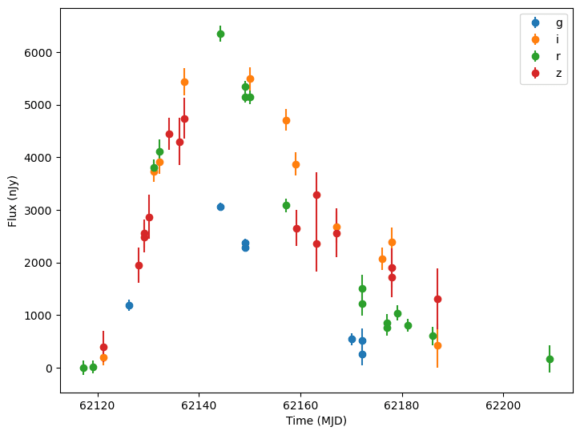

Simulations
========================================================================================

Introduction
-------------------------------------------------------------------------------

.. figure:: _static/tdastro-intro.png
   :class: no-scaled-link
   :scale: 80 %
   :align: center
   :alt: TDAstro simulation components

   TDAstro simulation components

The TDAstro simulation function is designed to produce multiple samples from single population
of objects and their observed light curves as determined by given survey information. The main
step includes the following components:

* A statistical simulation step where parameters (and hyperparameters) of the modeled phenomenon
  are drawn from one or more prior distributions.
* A mathematical model that defines the properties of the time-domain light source, which can
  also include a host-galaxy model, and is used to generate the noise-free light curves (given
  the sampled parameters).
* ``ObsTable`` contains the survey information such as survey strategy and observing
  conditions. It is used to specify the observing times and bands.
* A set of predefined effects, such as dust extinction and detector noise, are applied to
  the noise-free light curves to produce realistic light curves.
* The ``PassbandGroup`` contains the filter information of the telescope and is used
  to calculate the fluxes in each band.

To perform a simulation that includes different populations of objects, the user would run the core
simulate function multiple times--once for each population. The results can then be concatenated together
to provide a full set of observations.

For an overview of the package, we recommend starting with the notebooks in the "Getting Started"
section of the :doc:`notebooks page <notebooks>`. The :doc:`glossary <glossary>` provides definitions of
key terms, such as *GraphState*, *Node*, *Parameter*, *ParameterizedNode*, *BasePhysicalModel*,
*BandfluxModel*, and *SEDModel*.

Defining a parameterized model
-------------------------------------------------------------------------------

The core idea behind TDAstro is that we want to generate light curves from parameterized models
of astronomical objects/phenomena. The ``BasePhysicalModel`` class defines the structure for modeling
physical objects and is subclassed into ``SEDModel`` (for models that simulate the full spectral energy
distributions) and ``BandfluxModel`` (for models that simulate band fluxes). By providing a distribution of
parameter values into the model, users can simulate an entire population of these objects. For example, they
could use the `SALT2JaxModel` with parameterized values of `c`, `x0`, and `x1` to simulate a population of
Type Ia supernovae. 

In addition to the built-in models, the software provides wrappers to common modeling packages such as
`sncosmo <https://sncosmo.readthedocs.io/en/stable/>`__ (see the `SncosmoModel` class).
Users can also create their own models by subclassing either ``SEDModel`` or ``BandfluxModel``.

For new SED-type models, the class needs to implement a ``compute_sed()`` function that generates the
noise-free flux densities in the object's rest frame given information about the times, wavelengths, and
model parameters (called graph_state). Both the times and wavelengths are converted to account for redshift
before being passed to the ``compute_sed()`` function, so the function takes rest frame times and wavelengths.

.. code-block:: python

    def compute_sed(self, times, wavelengths, graph_state, **kwargs):

For new Bandflux-type models, the class needs to implement a ``compute_bandflux()`` function that generates the
band fluxes in the observer frame given the times, bands, and model parameters (called graph_state). These
models do not account for redshift, since simulation is done in the observer frame.

A user of a particular physical model only needs to understand what parameters the model has
and how they are set. A user creating a new physical model additionally needs to know how the noise-free,
rest frame flux density values are generated from those parameters.

Parameterization
-------------------------------------------------------------------------------

The model's parameters are defined by a hierarchical model that can be visualized by a Directed Acyclic Graph (DAG).
This means that the parameters to our physical model, such as a type Ia supernova, can themselves be sampled
based on distributions of hyperparameters. For example, a simplified SNIa model with a host component
can have the following DAG:

   An example DAG for a SNIa model

In this example, the parameter ``c`` is drawn from a predefined distribution, while the parameter ``x1``
is drawn from a distribution that is itself parameterized by the ``host_mass`` parameter. TDAstro handles
the sequential processing of the graph so that all parameters are consistently sampled for each object.

See the :doc:`Introduction notebook<notebooks/introduction>` for details on how to
define the parameter DAG.

Generating light curves
-------------------------------------------------------------------------------

Sample light curves for a population are generated with a multiple step process. First, the object's parameter
DAG is sampled to get concrete values for each parameter in the model. This combination of parameters is called
the graph state (and is stored in a ``GraphState`` object), because it represents the sampled state of the DAG.

Next, the ``ObsTable`` is used to determine at what times and in which bands the object will be evaluated.
These times and wavelengths are based into the object's ``evaluate_sed()`` function along with the graph state.
The ``evaluate_sed()`` function handles the mechanics of the simulation, such as applying redshifts to both the
times and wavelengths before calling the ``compute_sed()``.

.. figure:: _static/compute_sed.png
   :class: no-scaled-link
   :scale: 80 %
   :align: center
   :alt: An example of the compute_sed function

   An example of the compute_sed function

Additional effects can be applied to the noise-free light curves to produce more realistic light curves.
The effects are applied in two batches. Rest frame effects are applied to the flux densities in the frame.
The flux densities are then converted to the observer frame where the observer frame effects are applied.

Finally, the raw flux densities are are converted into the magnitudes observed in each band using the
``PassbandGroup``.

Generating band flux curves
-------------------------------------------------------------------------------

All models provide a helper function, ``evaluate_bandfluxes()``, that wraps the combination of
evaluation and integration with the passbands. This function takes the passband information,
a list of times, and a list of filter names. It returns the band flux at each of those times
in each of the filters.

   An example of the evaluate_bandfluxes function

In addition to being a convenient helper function, generating the data at the band flux level allows
certain models to skip SED generation. In particular a ``BandfluxModel`` is a subclass of the ``PhysicalModel``
whose computation is only defined at the band flux level. An example of this are models of empirically
fit light curves, such as those from LCLIB. Since we do not have the underlying SEDs for these types of models,
so we can only work with them at the band flux level. See the
:doc:`lightcurve template model <notebooks/lightcurve_source_demo>` for an example of this type of model.

**Note** that most models in TDAstro operate at the SED level and we *strongly* encourage new models to
produce SEDs where possible. Working at the finer grained level allows more comprehensive and accurate
simulations, such as accounting for wavelength and time compression due to redshift. The models that generate
band fluxes directly will not account for all of these factors.

Examples
-------------------------------------------------------------------------------

After loading the necessary information (such as ``PassbandGroup`` and ``ObsTable``),
and defining the physical model for what we are simulating, we can generate light curves
with realistic cadence and noise.

   Simulated light curves of SNIa from LSST

See our selection of :doc:`tutorial notebooks <notebooks>` for further examples.

Simulating from Multiple Surveys
-------------------------------------------------------------------------------

TDAstro can simulate observations from multiple surveys in a single run by passing a list of
``ObsTable`` and a list of ``PassbandGroup`` to the ``simulate_lightcurves()`` function.
The parameter space is sampled once for each simulated object, so the observations in each
survey are consistent with respect to the parameterization. The times of observation and filters
used are determined by each survey. And the bandflux is computed using that survey's passbands.

For an example see the :doc:`Simulating from Multiple Surveys notebook <notebooks/multiple_surveys>`.
